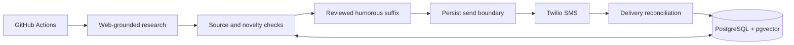

# Scotland Facts

**A little more Scotland. One source-backed fact at a time.**

A scheduled Python pipeline that researches a Scottish fact, checks its sources,
filters out repeats, adds a small dose of absurd humor, and sends it by SMS.
Built around a simple rule: preserve the fact, and never retry an uncertain send.

[Visit the site](https://dobbes.github.io/scottish_facts/) ·
[Architecture](guides/architecture.md) ·
[Deployment guide](guides/USER_SETUP.md) ·
[Security](SECURITY.md)

```text
SCOTLAND FACTS: Scotland's national animal is the unicorn. The unicorns have declined to comment. Reply STOP to opt out.
```

## How it works



| Layer | Responsibility |
| --- | --- |
| Research | OpenAI web search, structured candidates, and citations extracted from tool metadata |
| Validation | Source checks, normalized exact duplicates, semantic similarity, and 14-day subject fatigue |
| Composition | An unchanged factual sentence, a reviewed suffix, and a fixed STOP footer; 300 characters maximum |
| Persistence | PostgreSQL audit records, pgvector embeddings, and atomic final novelty checks |
| Delivery | One Twilio create attempt per daily run, with committed send state and later reconciliation |
| Scheduling | GitHub Actions at **10:15 AM America/New_York**, following daylight-saving changes |

### Designed for reliable side effects

- **At-most-once sending.** A unique daily run key and a committed send boundary
  prevent automatic duplicate sends, even after a timeout.
- **Fresh content.** Exact, semantic, and subject-based repetition checks include
  persisted previews as well as production facts.
- **Separated fact and humor.** The style step selects a reviewed suffix; it cannot
  rewrite the accepted fact or opt-out instruction.
- **Private recipient configuration.** Phone numbers stay in restricted
  configuration and the Twilio boundary, outside the database and OpenAI prompts.
- **Explicit delivery controls.** Sending and confirmed consent must both be
  enabled. A persisted subscription suppression survives configuration changes.

## Quick start

Requires **Python 3.12+**. Production uses Python 3.12.

```bash
python -m venv .venv
# Activate .venv in your shell, then:
python -m pip install -e ".[dev]"
python -m pytest
```

For a local deployment, copy `.env.example` to `.env` and supply the credentials
needed for your command. For a GitHub-only deployment, keep active credentials
in **Actions secrets** and follow the [deployment guide](guides/USER_SETUP.md).

```bash
python -m scotland_facts.cli migrate
python -m scotland_facts.cli doctor
python -m scotland_facts.cli run --dry-run
```

A dry run performs paid OpenAI research and persists the accepted preview, but
sends no SMS. `doctor` checks configuration and the database; `doctor --live`
also checks provider connectivity without sending.

## Scheduled operation

Add these repository **secrets**:

```text
OPENAI_API_KEY             SUPABASE_DB_URL
TWILIO_ACCOUNT_SID         TWILIO_API_KEY_SID
TWILIO_API_KEY_SECRET      TWILIO_FROM_NUMBER
RECIPIENT_NUMBER
```

The non-secret repository **variables** `SMS_SEND_ENABLED` and
`RECIPIENT_CONSENT_CONFIRMED` both default to `false`. After provider registration,
recipient consent, and a successful Actions dry run, enable both for daily delivery.
Manual workflow runs default to dry-run mode.

The current version supports **one recipient**. An additional phone-number secret
does not add another recipient. GitHub scheduling is best-effort rather than an
exact delivery-time guarantee.

## Repository map

```text
.github/workflows/       Scheduled delivery and credential-free CI
docs/                   Public GitHub Pages site and messaging policies
guides/                 Architecture, deployment, registration, and design notes
migrations/             Versioned PostgreSQL schema and access controls
scripts/                Similarity calibration and read-only secret auditing
src/scotland_facts/     Python application and CLI
tests/                  Unit, contract, and opt-in PostgreSQL integration tests
```

The repository is named `scottish_facts`; the importable Python package is
`scotland_facts` inside `src/`, following the standard Python source layout.

## Development

```bash
python -m pytest
python -m compileall -q src tests scripts
python scripts/audit_secrets.py --history
```

The default test suite uses fake provider boundaries and sends no messages.
Real PostgreSQL concurrency tests are opt-in through `SCOTLAND_FACTS_TEST_DB_URL`;
see the [test details](guides/architecture.md#tests). The secret audit prints
locations and rule names, never matched values; synthetic fixtures need review.

See [CONTRIBUTING.md](CONTRIBUTING.md) for the development workflow. Exact validated
dependency versions are recorded in `requirements.lock`.

## Documentation

- [Architecture and operational guarantees](guides/architecture.md)
- [Deployment and operator guide](guides/USER_SETUP.md)
- [SMS campaign registration guide](guides/RESUBMISSION.md)
- [Implementation specification](guides/CLI_SPEC.md) and [design audit](guides/SPEC_AUDIT.md)
- [Privacy policy](https://dobbes.github.io/scottish_facts/privacy/),
  [messaging terms](https://dobbes.github.io/scottish_facts/terms/), and
  [verbal enrollment](https://dobbes.github.io/scottish_facts/enrollment/)

## Program and support

Scotland Facts is operated by Elumsden Sole. It is an invitation-only informational
and entertainment SMS program, with no public signup form. Support:
[brunslx@gmail.com](mailto:brunslx@gmail.com).

Inbound STOP/HELP handling is provider-configured; the application has no inbound
webhook. Subscription requests and consent records are handled privately. Please
do not post phone numbers, credentials, or personal information in public issues.
